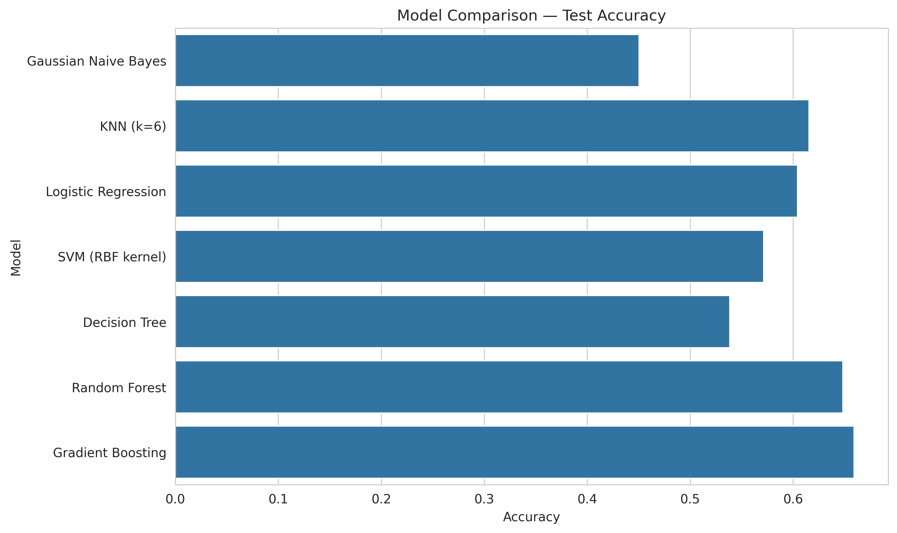
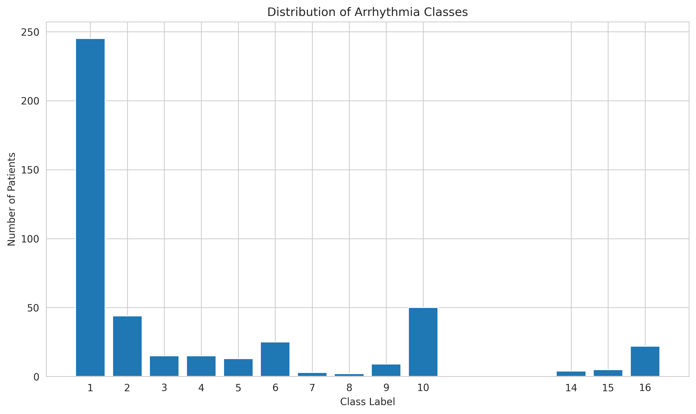
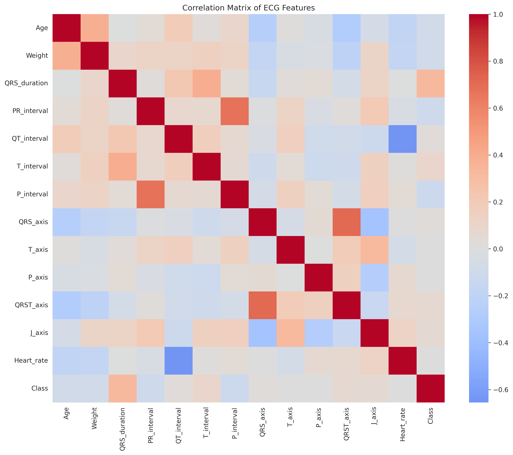
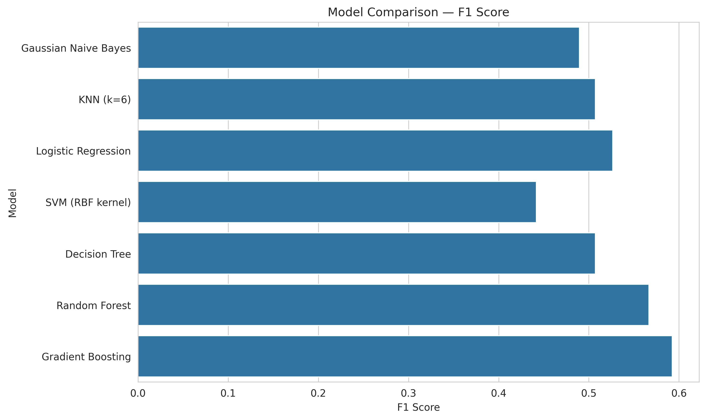
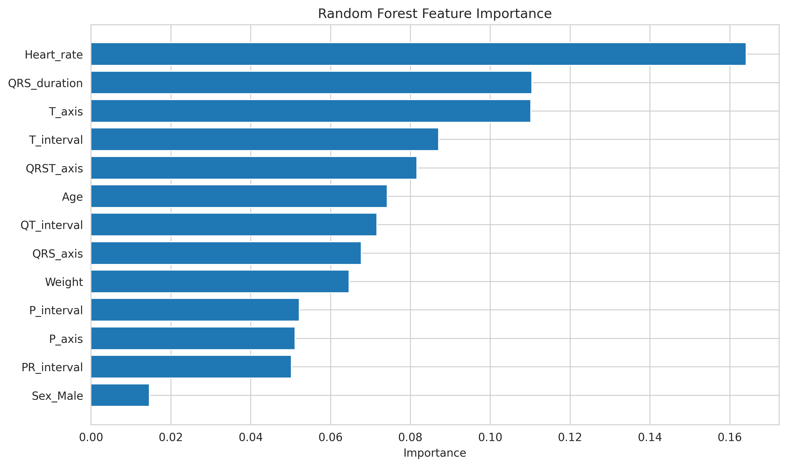

# arrhythmia-classification-ml
Machine learning models for cardiac arrhythmia classification using ECG-derived features (UCI Arrhythmia dataset).
# Arrhythmia Classification Using Machine Learning



*Comparison of classification models based on test accuracy.*

---

## Project Overview

Cardiac arrhythmias are abnormalities in the heart’s electrical activity that can lead to serious medical conditions.
Accurate automated detection can assist clinicians in diagnosing heart rhythm disorders and improving patient outcomes.

This project evaluates several machine learning algorithms for **multiclass arrhythmia classification** using ECG-derived features from the **UCI Arrhythmia dataset**.

The analysis demonstrates how different machine learning models behave on a **high-dimensional, imbalanced biomedical dataset**, and compares their predictive performance.

---

## Dataset

Source: UCI Machine Learning Repository
https://archive.ics.uci.edu/ml/datasets/Arrhythmia

Dataset characteristics:

* **452 patient observations**
* **279 ECG-derived features**
* **16 arrhythmia classes**
* Contains **missing values**
* Strong **class imbalance**

The dataset includes physiological measurements extracted from electrocardiograms (ECG), such as:

* heart rate
* QRS duration
* PR interval
* QT interval
* ECG axis measurements

These features reflect the electrical activity of the heart and are commonly used by cardiologists to diagnose rhythm disorders.

---

## Project Workflow

The analysis follows a complete machine learning pipeline:

1. Data loading and inspection
2. Missing value analysis
3. Feature selection and preprocessing
4. Exploratory Data Analysis (EDA)
5. Feature scaling and encoding
6. Model training and evaluation
7. Model comparison and final analysis

---

## Exploratory Data Analysis

### Class Distribution


*The dataset shows strong class imbalance, with the normal ECG class dominating the observations.*

---

### Correlation Between ECG Features


*Several ECG measurements exhibit moderate correlations, reflecting relationships between electrical conduction characteristics.*

---

## Machine Learning Models Evaluated

The following classification algorithms were implemented and evaluated:

* Gaussian Naive Bayes
* K-Nearest Neighbors (KNN)
* Logistic Regression
* Support Vector Machine (SVM)
* Decision Tree
* Random Forest
* Gradient Boosting

These models represent different machine learning paradigms:

* probabilistic models
* distance-based methods
* linear classifiers
* kernel-based algorithms
* tree-based models
* ensemble learning approaches

---

## Model Performance

| Model                 | Test Accuracy | F1 Score |
| --------------------- | ------------- | -------- |
| Gaussian Naive Bayes  | 0.45          | 0.49     |
| KNN (k=6)             | 0.62          | 0.51     |
| Logistic Regression   | 0.60          | 0.53     |
| SVM (RBF kernel)      | 0.57          | 0.44     |
| Decision Tree         | 0.54          | 0.51     |
| Random Forest         | 0.65          | 0.57     |
| **Gradient Boosting** | **0.66**      | **0.59** |

Gradient Boosting achieved the strongest overall performance.

---

## Model Comparison

### Test Accuracy


*Ensemble methods outperform simpler models on this dataset.*

---

### F1 Score Comparison


*F1 score comparison highlights the advantage of ensemble models under class imbalance.*

---

## Feature Importance

Random Forest feature importance reveals the ECG variables most relevant for arrhythmia classification.


*Heart rate and ECG axis measurements appear among the most influential predictors.*

Key predictors include:

* heart rate
* QRS axis
* T axis
* interval duration features

These features correspond to physiological signals cardiologists use to identify abnormal heart rhythms.

---

## Key Insights

* Ensemble models achieved the strongest performance
* Gradient Boosting provided the best predictive accuracy (~0.66)
* ECG axis measurements and interval durations are important predictors
* Severe class imbalance significantly increases classification difficulty

Overall, the results demonstrate that **ensemble tree-based methods are well suited for structured biomedical datasets**.

---

## Technologies Used

* Python
* Pandas
* NumPy
* Scikit-learn
* Matplotlib
* Seaborn
* Jupyter Notebook

---

## Repository Structure

```
arrhythmia-classification-ml
│
├── data
│   └── arrhythmia.zip
│
├── notebooks
│   └── arrhythmia-classification-ml.ipynb
│
├── figures
│   ├── class_distribution.png
│   ├── correlation_matrix_ecg_features.png
│   ├── model_comparison_test_accuracy.png
│   ├── model_comparison_f1_score.png
│   └── feature_importance_random_forest.png
│
├── requirements.txt
└── README.md
```

---

## Future Work

Possible improvements for future iterations include:

* hyperparameter tuning using cross-validation
* advanced techniques for handling class imbalance
* dimensionality reduction methods
* deep learning models for ECG signal analysis

---

## Author

Matthew Studnitskiy
